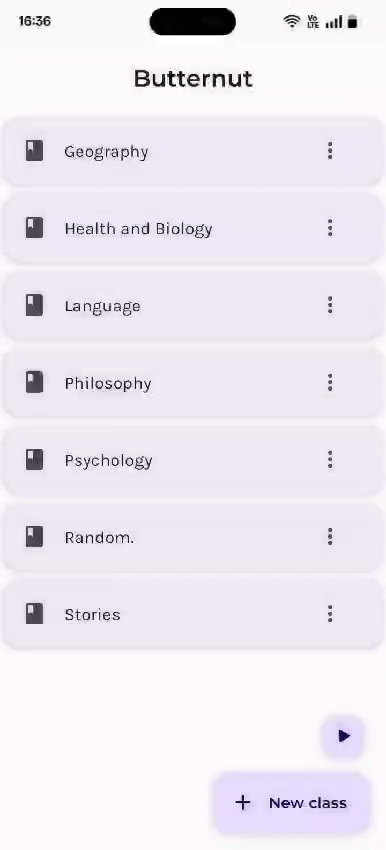

# Flashcard Recommendation App (Butternut)

Table of Contents

- [About](#about)
  - [Built With](#built-with)
- [Getting Started](#getting-started)
  - [Prerequisites](#prerequisites)
  - [Usage](#usage)
- [Acknowledgements](#acknowledgements)

## About

<table>
<tr>
<td>

This app helps users create digital flashcards and memorize information by leveraging two proven learning techniques: Active recall and Spaced repetition. 
I built it since I couldn't find any other good and **free** alternatives in this category. It uses ***weighted random sampling*** to recommend the next flashcard to the user. The 
weight for a given card is the users confidence on their ability to recall info on that card. It also features a hierarchical structure inspired by Brainscape.
At the top level, we have a _class_. Under class, we have _decks_ and under a deck we have _flashcards_. For example **Geography** could be a _class_. Under **Geography**, 
we could have multiple decks, for example one for each country (let's assume **USA**). Under **USA**, we could have multiple flashcards containing questions/info around 
USA geography. 

Other apps in this category are:
 - AnkiDroid (free but [doesn't](https://www.google.com/imgres?q=ankidroid%20flashcards&imgurl=https%3A%2F%2Fcdn6.aptoide.com%2Fimgs%2Fb%2F2%2Fd%2Fb2d8d716f5f374cdd71a70b1931e66e7_screen.png&imgrefurl=https%3A%2F%2Fankidroid.en.aptoide.com%2Fapp&docid=hbOXchIYwGrBsM&tbnid=9xwQzcm83sHxrM&vet=12ahUKEwjy_7rGmeiJAxUqxjgGHUJZKDIQM3oFCIQBEAA..i&w=427&h=800&hcb=2&ved=2ahUKEwjy_7rGmeiJAxUqxjgGHUJZKDIQM3oFCIQBEAA) have a nice UX)
 - Brainscape (great UX but paid)
 - Duocard (only helps with word memoraization and is also paid) 

</td>
</tr>
</table>

### Built With

- Kotlin
- Jetpack Compose

## Getting Started
### Prerequisites
An android mobile and android studio. This is not currently available on Playstore so people interested in trying it out will need to install it via android studio.
### Usage

#### Create a Flashcard
To create a flashcard we need to follow the steps outlined below:
1. Create a Class
2. Create a Deck
3. Create a Flashcard

Create a Class.                       | Create a Deck                      | Create a Flashcard
--------------------------------------|------------------------------------|----------------------
    |  |  

#### Revising Flashcards

All Flashcards.                       | Flashcards within a class          | Flashcards within a deck
--------------------------------------|------------------------------------|----------------------
    |  |  

#### Upload/Download feature

<table align="center">
    <tr>
      <td align="center">
        Upload
      </td>
      <td align="center">
        Download
      </td>
    </tr>
    <tr>
    <td>
      
    </td>
    <td>
       
    </td>
    </tr>
</table>

## Acknowledgements
The development of this project was aided by the following online resources.
- https://developer.android.com (for all Compose tutorials)
- https://github.com/dec0dOS/amazing-github-template (for this README template)
